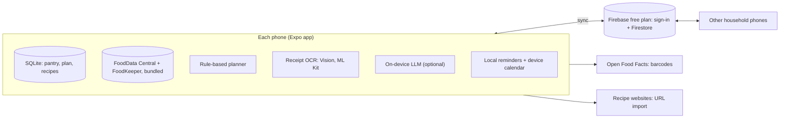

# Meal Planner: build log

I'm building a household kitchen app from zero to one. The code is private for now; this repo tracks the problem, the decisions and the progress.

## The problem

Most evenings at home start with the same question: what can we cook with what's in the fridge? Picking from memory leads to the same few meals, or to ordering in. Groceries bought for a plan get forgotten and expire. And nobody knows whether the week's meals had enough protein or fiber.

## What I'm building

One loop instead of five apps:

1. **Pantry:** what we have and how long it keeps, so the soonest-to-expire gets used first
2. **Plan:** a week of meals built from the pantry, with takeout nights planned in
3. **Prep:** soak, thaw and marinate reminders plus calendar blocks, timed back from dinner
4. **Cook and log:** cooking updates the pantry and logs what each person ate
5. **Shop:** the list is the plan minus the pantry

## Constraints

- **Household first.** It becomes a product only if we keep using it ourselves.
- **Zero running cost.** All AI runs on the phone; the cloud only syncs household phones, on a free tier.
- **Solo, nights and weekends.**

## Stack

Expo (React Native, TypeScript) · SQLite on the device · Firebase free plan for sign-in and sync · USDA FoodData Central and FoodKeeper bundled in the app · on-device OCR (Apple Vision, Google ML Kit) · optional on-device LLM (Apple Foundation Models, Gemini Nano)

## Architecture

## Roadmap

Each phase starts only when the one before it passes its gate.

| Phase | When | Gate to the next phase |
| --- | --- | --- |
| Foundations | Oct 2026 | 30 of our recipes import with nutrition within ±10% |
| Household MVP | Nov–Dec 2026 | We use it 4 weeks in a row and cook 80% of planned meals |
| Friends beta | Q1 2027 | 5+ households still planning weekly after 30 days |
| Public launch | Q2 2027 | |

## Devlog

- [2026-09-28: Kickoff](devlog/2026-09-28-kickoff.md): market scan, PRD and the first decisions

## Decisions

Short records of the choices that shape the build: [DECISIONS.md](DECISIONS.md)
